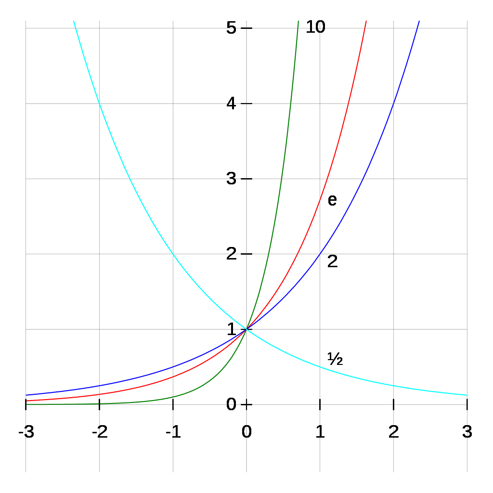
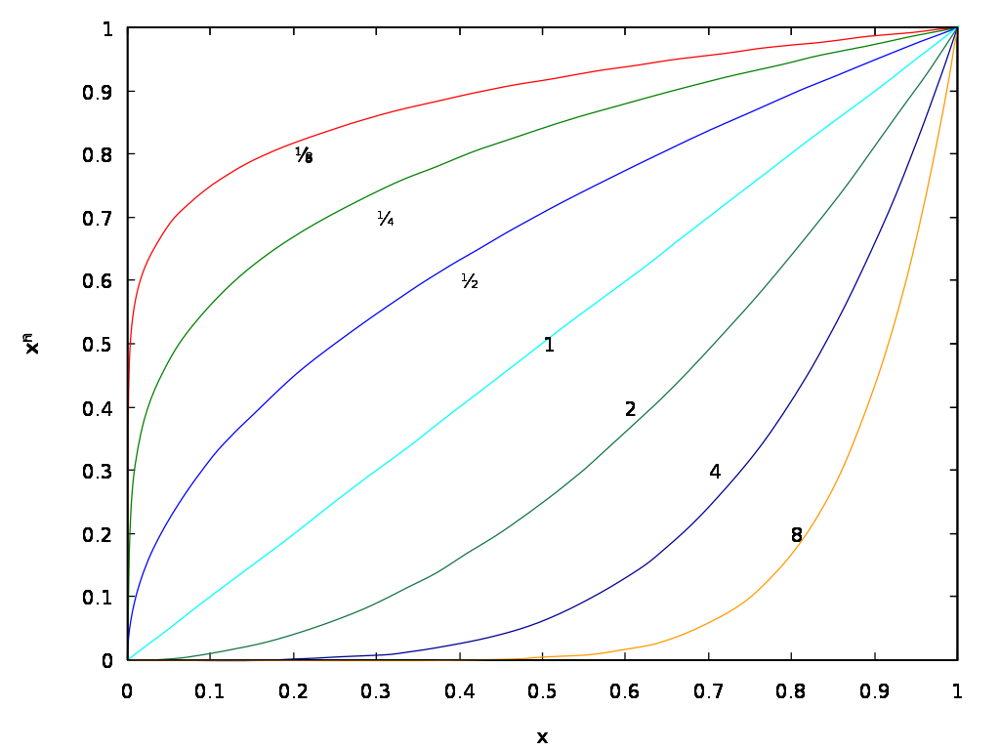
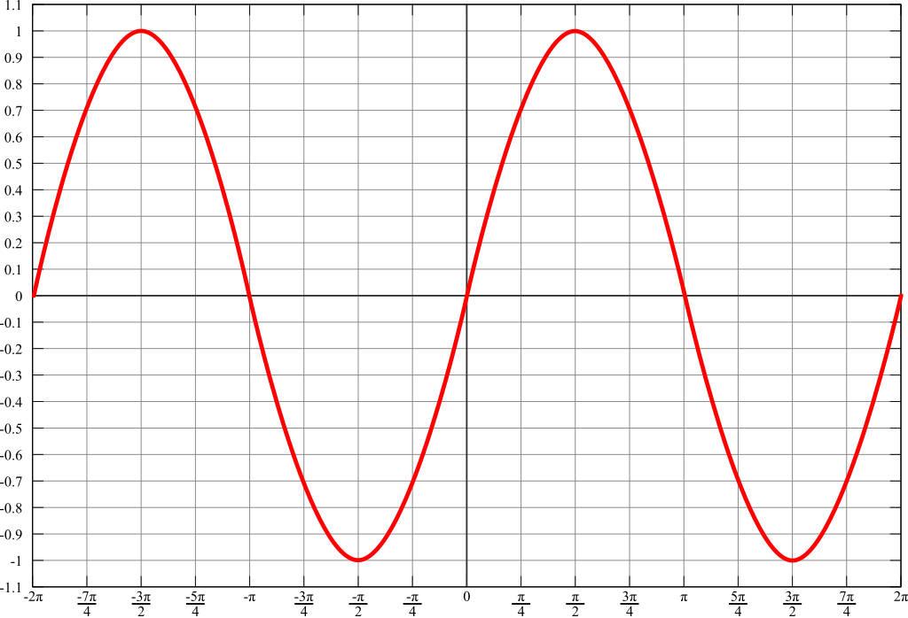
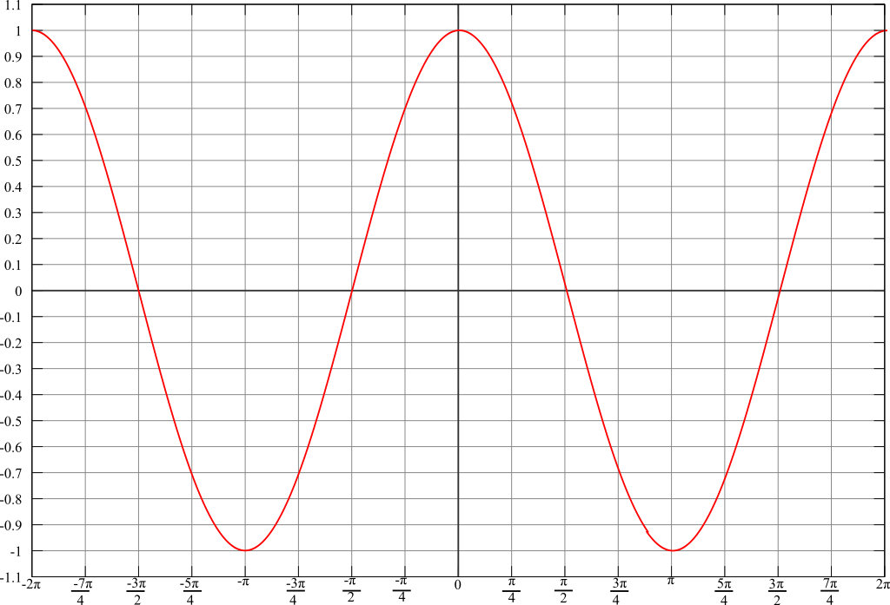
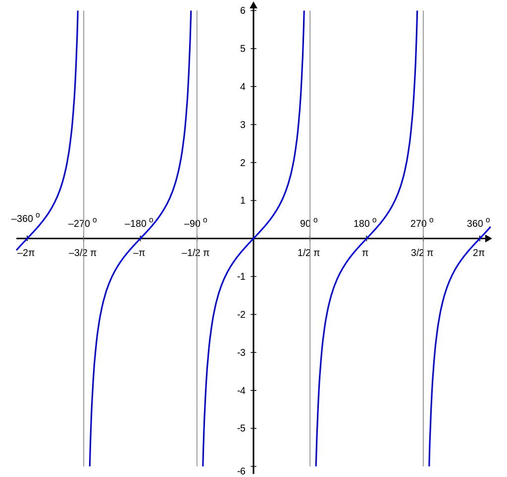
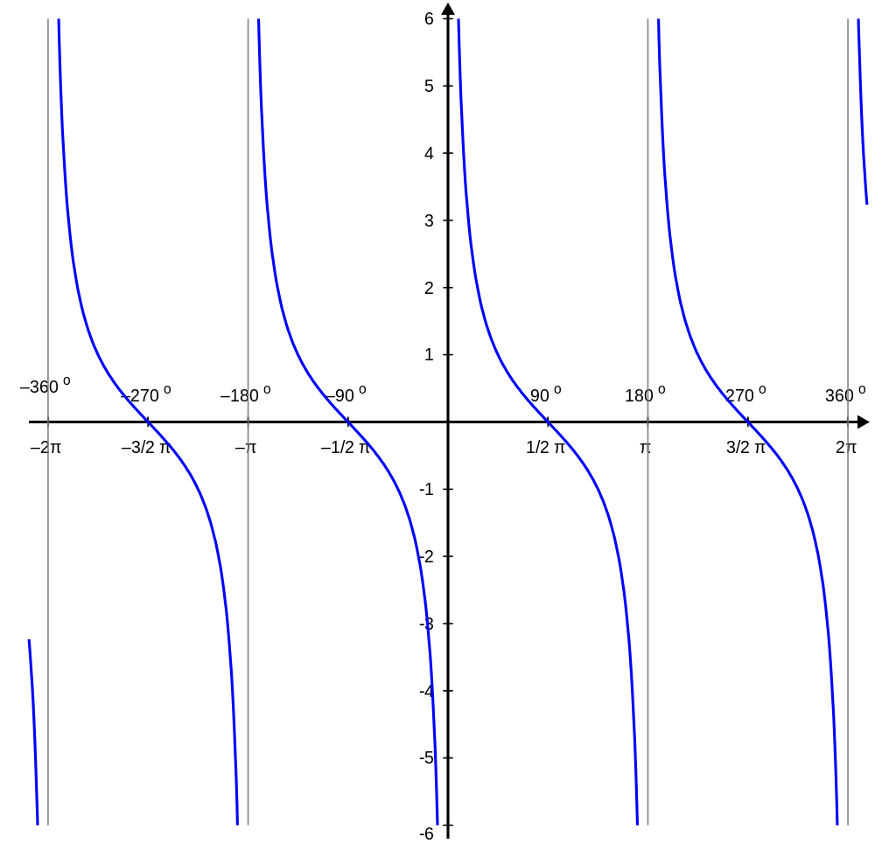
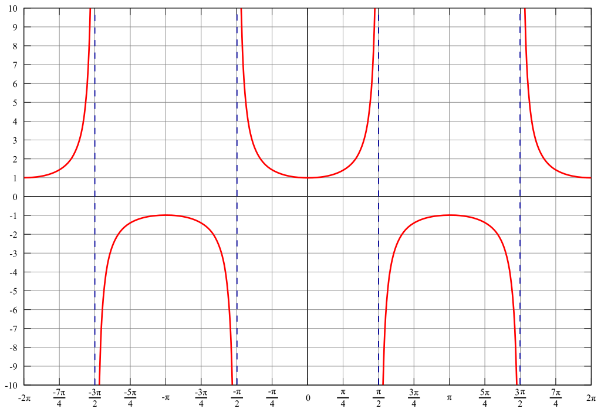
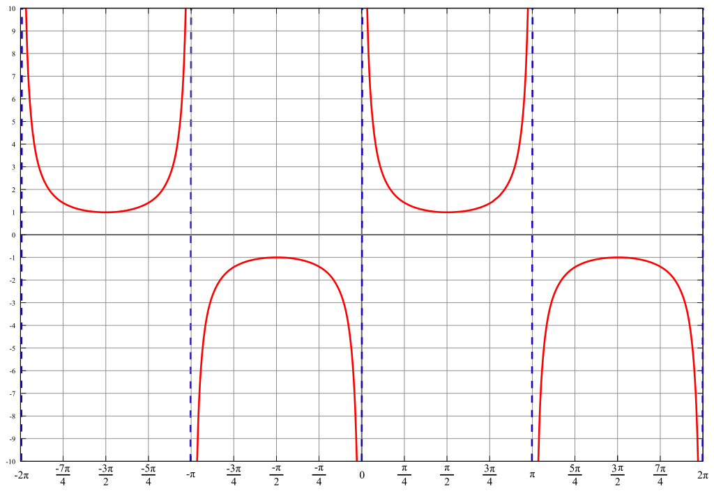
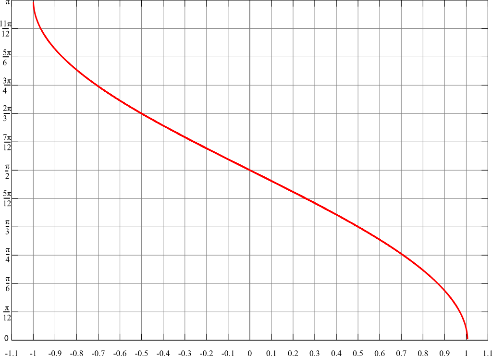
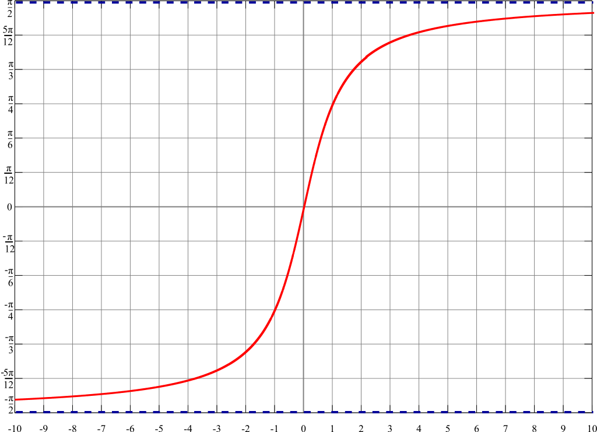

# 0 基本初等函数的五大基本性质

?> 基本初等函数包括常值函数、指数函数、幂函数、三角函数、反三角函数等，主要需要研究的性质有单调性、奇偶性、周期性、定义域、值域、有界性和图象等。

## 指数函数 $y=a^x$

- 函数 $y=a^x$，其中 a 为底数，自变量 x 是指数
- 不存在奇偶性和周期性
- 定义域为 R，值域为 $(0,\,+\infty)$
- 当 $a > 0$ 时函数单调递增，$a < 0$ 时函数单调递减
- 是无界函数，存在下界
- 图象恒过定点 $(0,\,1)$

## 幂函数 $y=x^a$

> 上图从上至下分别是 $\, x^{\frac{1}{8}}\quad x^{\frac{1}{4}}\quad x^{\frac{1}{2}}\quad x^1\quad x^2\quad x^4\quad x^8$

- 函数 $y=x^a$，其中自变量 x 为底数，a 是指数
- 当 $x=2k,\, k \in N^*$ 时，x 在 $(-\infty,\,0)$ 上单调递减，在 $(0,\,+\infty)$ 单调递增
- 当 $x=2k+1,\, k \in N^*$ 时，x 在 R 上单调递增
- 定义域具体情况具体分析
- 函数是否有界具体情况具体分析

## 对数函数 $y={\log_a}^x$

- 函数 $y={\log_a}^x$，a 为底数，自变量 x 为真数
- 不存在奇偶性和周期性
- 定义域为 ${(0,\,+\infty)}$，且 $a\in \lbrace a \mid a > 0,\, a \not= 1 \rbrace$
- 值域为 R
- $0 < a < 1$ 时函数单调递减，$a > 1$ 时函数单调递增
- 是无界函数，既不存在上界也不存在下界
- 图象恒过定点 $(1,\,0)$

## 正弦函数 $y=\sin x$

- 奇函数，对称中心为 $(k \pi,\,0),\, k \in Z$
- 最小正周期是 $2 \pi$，周期是 $2k \pi,\, k \in Z$
- 定义域为 R，值域是 $(-1,\,1)$
- 函数在 $(-\frac{1}{2}\pi + 2k\pi,\,\frac{1}{2}\pi + 2k\pi)$ 上单调递增，在 $(\frac{1}{2}\pi + 2k\pi,\,\frac{3}{2}\pi + 2k\pi)$ 上单调递减
- 函数是有界函数
- 函数经过点 $(k \pi,\,0),\,k \in Z$

## 余弦函数 $y=\cos x$

- 偶函数，对称轴为 $x=k \pi,\, k \in Z$
- 最小正周期是 $2 \pi$，周期是 $2k \pi,\, k \in Z$
- 定义域为 R，值域是 $(-1,\,1)$
- 函数在 $(\pi + 2k \pi,\,2 \pi + 2k \pi),\, k \in Z$ 上单调递增，在 $(2k \pi,\,\pi + 2k \pi),\, k \in Z$ 上单调递减
- 函数是有界函数
- 函数经过点 $(\frac{\pi}{2} + k \pi,\,0),\,k \in Z$

## 正切函数 $y=\tan x$

- 奇函数，对称中心为 $(k \pi,\, 0),\, k \in Z$
- 最小正周期是 $\pi$，周期是 $k \pi,\, k \in Z$
- 定义域为 $\lbrace x \mid x \not= \frac{k \pi}{2},\, k \in Z \rbrace$
- 函数在每个周期之内的那一支单调递增
- 函数是无界函数
- 函数经过对称中心

## 余切函数 $y=\cot x$

> 可以参考正切函数进行类比记忆

- 奇函数，对称中心为 $(k \pi,\, 0),\, k \in Z$
- 最小正周期是 $k \pi,\, k \in Z$
- 定义域为 $\lbrace x \mid x \not= \frac{k \pi}{2},\, k \in Z \rbrace$
- 函数在每个周期之内的那一支单调递减
- 函数是无界函数
- 函数经过对称中心

## 正割函数 $y=\sec x$

- 偶函数，对称轴 $x= k \pi,\,k \in Z$
- 最小正周期是 $2 \pi$，周期是 $2k \pi,\,k \in Z$
- 定义域为 $\lbrace x \mid x \not= \frac{k \pi}{2},\, k \in Z \rbrace$
- 函数在 $(2k \pi,\, \pi + 2k \pi),\, k \in Z$ 中的每一支图象分别单调递增，在 $(\pi + 2k \pi,\,2 \pi + 2k \pi),\, k \in Z$ 中的每一支图象分别单调递减
- 函数是无界函数
- 函数恒过 $(2k \pi,\, 1),\, k \in Z$ 和 $(\pi + 2k \pi ,\, -1),\, k \in Z$

## 余割函数 $y=\csc x$

- 奇函数，对称中心是 $(k \pi,\, 0), k \in Z$
- 最小正周期是 $2 \pi$，周期是 $2k \pi,\,k \in Z$
- 定义域为 $\lbrace x \mid x \not= k \pi + \frac{\pi}{2},\, k \in Z \rbrace$
- 函数在 在 $(\pi + 2k \pi,\,2 \pi + 2k \pi),\, k \in Z$ 中的每一支图象分别单调递增，在 $(2k \pi,\, \pi + 2k \pi),\, k \in Z$ 中的每一支图象分别单调递减
- 函数是无界函数
- 函数恒过 $(\frac{\pi}{2} + k \pi,\, 1),\, k \in Z$ 和 $(\frac{3 \pi}{2} + 2k \pi ,\, -1),\, k \in Z$

## 反正弦函数 $y=\arcsin x$

- 奇函数
- 没有周期性
- 定义域为 $(-1,\,1)$
- 函数在定义域内单调递增
- 函数是无界函数

## 反余弦函数 $y=\arccos x$

- 奇函数
- 没有周期性
- 定义域为 $(-1,\,1)$
- 函数在定义域内单调递减
- 函数是无界函数

## 反正切函数 $y=\arctan x$

- 奇函数
- 没有周期性
- 定义域为 R
- 函数在定义域内单调递增
- 函数是有界函数
